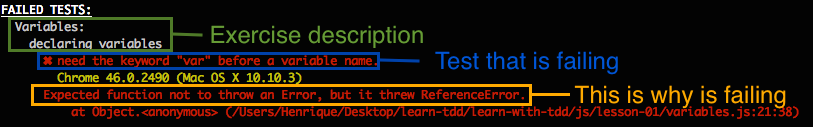
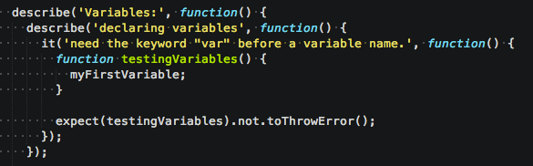

# Learn with TDD
Learn Javascript and frameworks with unit testing.

## Getting Started

### Prerequisites
Install NodeJS https://nodejs.org/

### Download / Clone

Clone the repo using Git:

```bash
git clone https://github.com/HenriqueLimas/learn-with-tdd.git
```

Alternatively you can [download](https://github.com/HenriqueLimas/learn-with-tdd/archive/master.zip)
this repository.

### Build

Install the necessary dependencies, from the root of the project:
```bash
npm install -g learn-with-tdd karma-cli && npm install
```

### Lessons

Run the following one liner to run JS first lesson (Total lessons: 10).
```bash
ltdd js lesson1
```

### Lesson 0

**Terminal output:**



**Test source:**



The framework used to write the tests is [Jasmine](http://jasmine.github.io/2.3/introduction.html) 
because is easy to learn and write. Below is the syntax description:

```describe```: is used to create tests groups and it meens what is being tested. 
In the image above are ```'Variables'``` and ```'declaring variables'```.

```it```: this is the test to do.

```expect```: Take a value, that is the actual, and it is chained with a Matcher function which takes 
the expected value. In the example the actual value is ```testingVariables``` and the Matcher is ``` toThrowError```.
To pass all the tests it needs to make the ```expect``` be true. 
In the example above the function ```testingVariables``` is throwing an error, because
there is a syntax error inside. It needs to correct that and make the ```testingVariables``` 
not to throw an error.
